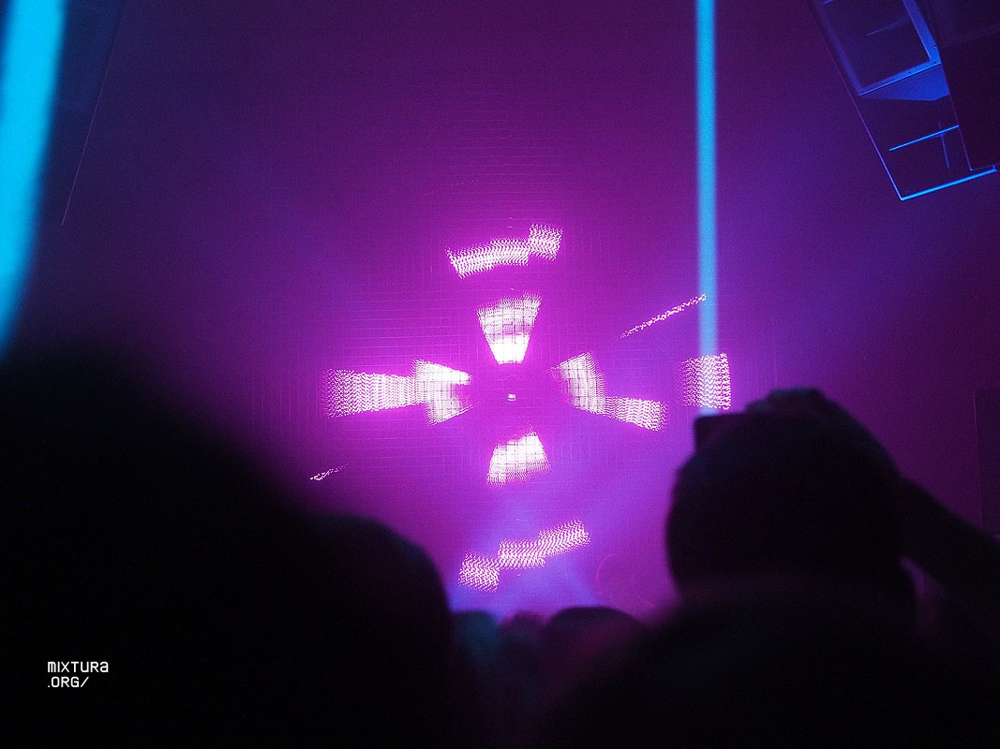
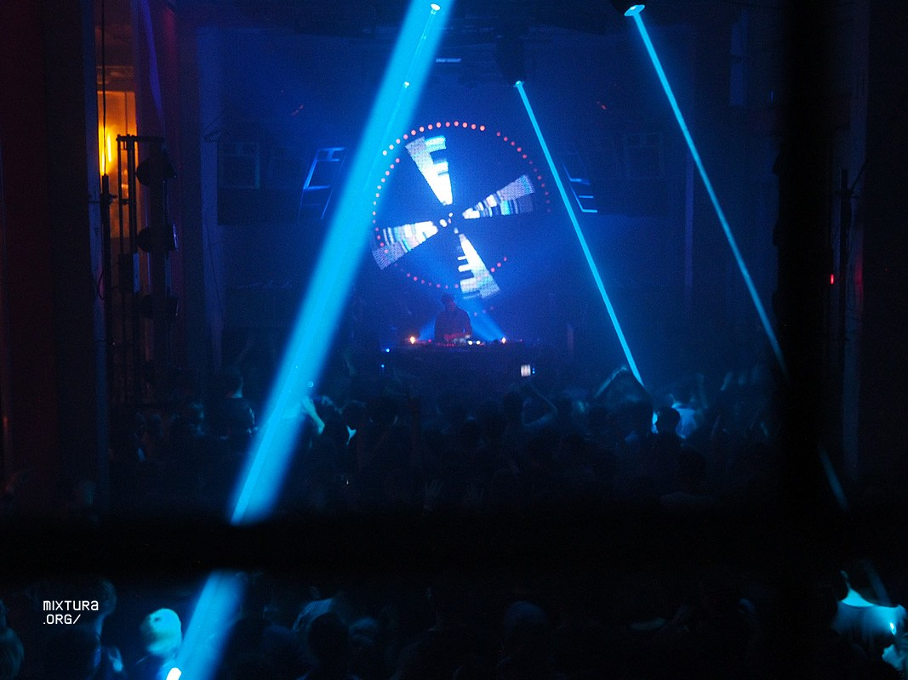
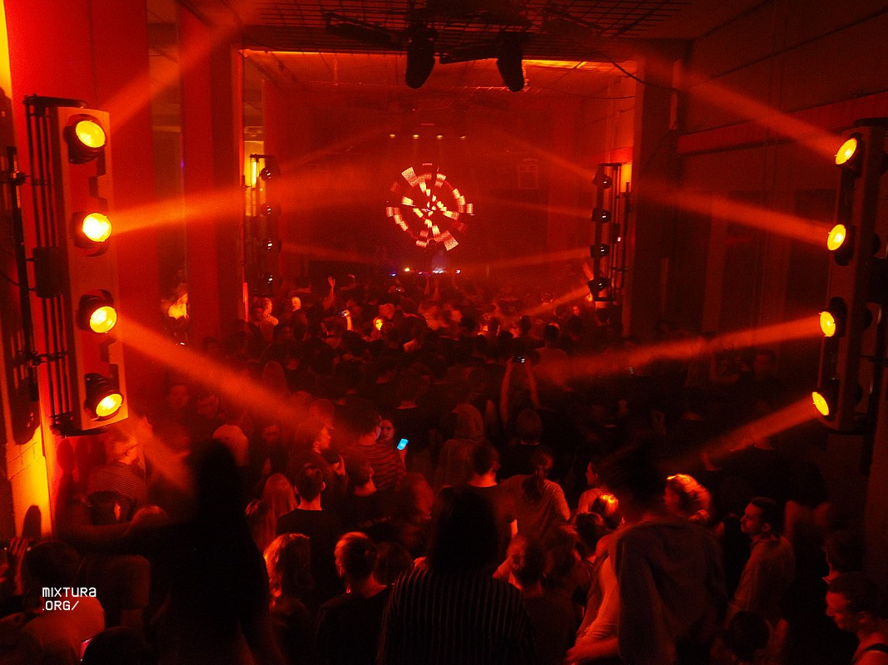
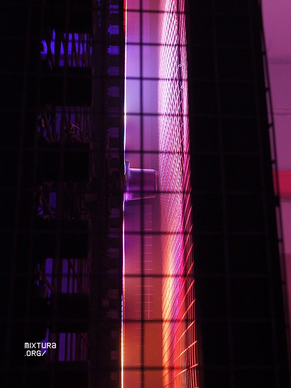

Audio-reactive kinematic light installation for Arma17 Brave event in collaboration with System Dynamics.

**Crew:**

led programming and mapping: Tim Tavlintsev (TVL)

led control: Tim Tavlintsev & Vadim Bioman

kinematics: Stepan Grigoryan (System Dynamics)

light control: Stepan Novikov

