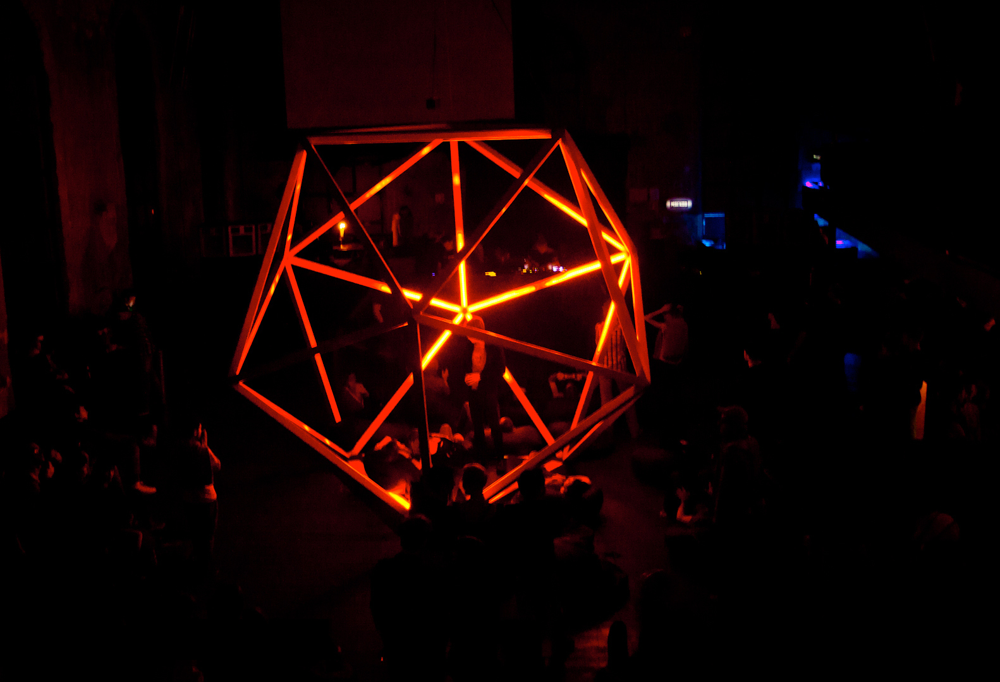

Audio-reactive 3D light installation.

Research of possibility of creating physical space, where virtual 3D scene will cross reality not in usual 2D projection, but in three dimensional physical space, immerse audience in the swim. Virtual space creates in the custom made software using openFrameworks.

The space consists of icosahedron object and simple geometric shapes (pyramids, spheres, cubes, etc.) that moves around and deforms depending on the real word factors, for example sounds or human position inside space. On the real object light appears in places where shapes cross wireframe of virtual Icosahedron. The audience dives into the space that never exists before where light forms perception with the help of 2400 RGB LED. It is interesting to explore how this 3D space can interact and deliver emotional feedback to the audience inside it.

This project becomes the finalist in Google DevArt competition.
Detailed description of this project can be found at [DevArt Icosahedron](https://devart.withgoogle.com/#/project/16557756)

<iframe src="https://player.vimeo.com/video/85965568" width="16" height="9" frameborder="0" webkitallowfullscreen mozallowfullscreen allowfullscreen></iframe>
