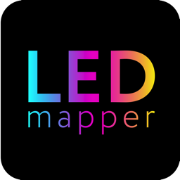

Open-source software+hardware platform to control distributed light systems by network.
Current version support digital LED strips and fixtures based on popular ICs like WS281X, SK6822, LPD8806, APA102, SK9822.
Over the last few years it was tested for more than 30 controllers driving more than 60 000 LEDs.

Platform consists of:

- app for mapping/grabbing LEDS from using Syphon (OSX) or Spout(WIN) inputs or built-in video player
- ready to use image for Raspberry Pi 3, that runs listener for udp packets and sends data to LEDs via GPIO

### Made with ledMapper

Insight club and restaurant located in skyscraper on 354 meters height, where ledMapper controls 1300 meters of digital LED strips:

### Application

Developed based on many years of experience of mapping and control digital LEDs

Detailed interface description and starters guide can be found at [ledMappers Wiki](https://github.com/techtim/ledMapper/wiki).

### Controller

Raspberry Pi (RPI) was chosen as the most accessible, cheap and multifunctional hardware around the world.
It wasn't design to control LEDs ICs having 3.3V output signal when 5V recomended, but for 5V ICs it almost always work (without luck for 12V).

To overcome this restriction and to protect RPI from wrong connection and short circuit, RPI shield was developed with following params:

- input voltage from 5 to 16V, to safely use with 12V LED ICs
- multiplexer for making two DATA+CLOCK outputs from one source
- 2 channels, each can drive 1000 LEDs DATA only (WS281x, sk6812) or 3000 DATA+CLOCK
- simple electric scheme for easy reproduction anywhere

### Features in progress

Project is in active development, currently in progress:

- Autonomous Raspberry Pi version that loads a project from usb-flash and plays it as was configured on a computer
- Raspberry Pi shield to raise controll signal voltage, add second DATA+CLOCK output and physical control with rotary encoder
- Nice durable case for comfort installation
- Art-Net protocol support

### Subscribe for updates

<link href='http://fonts.googleapis.com/css?family=Open+Sans:300italic,400italic,600italic,400,300,600,700' rel='stylesheet' type='text/css'/>

<form name="subscribe" method="POST" netlify>
<input type='text' name='email' placeholder='Your Email' />
<input value="Subscribe" class="button" type="submit" />
</form>

### Downloads

Here you can download executables for Mac and PC and get image for Raspberry Pi to write it SD card using [Etcher](https://etcher.io/):

|                        OSX                        |                        WIN                        |                         RPI image                         |
| :-----------------------------------------------: | :-----------------------------------------------: | :-------------------------------------------------------: |
| [.app V0.1](../../downloads/ledMapperOSX_0.1.zip) | [.exe V0.1](../../downloads/ledMapperWIN_0.1.zip) | [image V0.1](../../downloads/ledMapperRPI3_image_0.1.zip) |

### Sources

ledMapper is open-source licensed under the GNU General Public License v2.0.
All source files can be found on [ledMapper github page](https://github.com/techtim/ledMapper).

